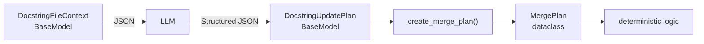

# JSON Serialization Design Rules

## 1. Purpose

Gyomuでは、LLMとのデータ交換、永続化、デバッグ出力など、JSONを扱う場面が複数存在する。

JSON化のために各オブジェクトへ個別の `to_jsonable()` 実装を追加すると、シリアライズ処理が各モデルに分散し、保守コストが増加する。

そのため、JSON境界を持つ構造化データにはPydantic `BaseModel`を使用し、JSONシリアライズ・デシリアライズはPydanticに委譲する。

---

## 2. Basic Rule

Gyomuでは、オブジェクトを以下の2種類に分類する。

### JSON境界を持つモデル

JSONとして出力される可能性があるモデルは、原則として `BaseModel` を使用する。

対象には以下を含む。

- LLMに渡すStructured Context
- LLMから受け取るStructured Output
- ファイルやキャッシュとして永続化するモデル
- デバッグ目的でファイル等へ出力する可能性があるモデル
- 外部API等とのJSON境界を持つモデル

### JSON境界を持たない内部モデル

純粋にロジックの途中でのみ使用され、JSONとして出力する必要がないモデルは `dataclass` を使用してよい。

例:

- アルゴリズム途中の値
- 内部処理用の状態
- JSON境界を持たない実行モデル

したがって、**すべてのモデルを `BaseModel` にする必要はない**。

---

## 3. LLM Structured Output

LLMから受け取るStructured Objectは `BaseModel` で定義する。

LLMが生成したJSONをPydanticでValidationし、Python Objectへ変換する。

```text
LLM
 ↓
JSON
 ↓
Pydantic Validation
 ↓
BaseModel
```

ここで重要なのは、アプリケーション側がJSONを手動で構築することではなく、LLMから返されたJSONを契約としてValidationすることである。

---

## 4. LLM Input

LLMへ渡す構造化されたコンテキストも、原則として `BaseModel` で定義する。

例えばDocstring生成では、

```text
DocstringFileContext
        ↓
JSON
        ↓
LLM
```

という境界を持つ。

`BaseModel` を使用することで、ネストされたモデルを含むJSON化をPydanticへ委譲できる。

```python
context.model_dump_json()
```

またはGyomu共通関数を使用する。

```python
dump_json(context)
```

LLM向けのJSON表現を調整する必要がある場合は、Pydanticの `model_dump()` / `model_dump_json()` のオプションを使用する。

---

## 5. Persistence

永続化するモデルは `BaseModel` で定義する。

例えば `ModuleAnalysis` のように、

```text
Object
  ↓
JSON
  ↓
File / Cache
```

という永続化境界を持つものが対象となる。

JSONから復元する場合は、PydanticによるValidationを行う。

Gyomuでは共通のJSON APIとして以下を使用する。

```python
def dump_json(value: BaseModel) -> str:
    return value.model_dump_json()
```

```python
def validate_json[T: BaseModel](
    model_type: type[T],
    data: str,
) -> Result[T, ValidationError]:
    ...
```

これにより、JSONの生成・Validation・Object化を各モデルで個別実装しない。

---

## 6. Debug Output

デバッグや調査目的でJSON出力する可能性があるモデルについても、`BaseModel` を使用する。

特にLLMを利用した処理では、途中の状態を保存して「どの段階から結果がおかしくなったか」を調査できることが重要である。

例えばDocstring生成では、以下のような中間オブジェクトがデバッグ対象となり得る。

```text
DocstringFileContext
        ↓
DocstringUpdatePlan
        ↓
MergePlan
        ↓
UpdatedDocstring
        ↓
FileUpdatePlan
```

実際にデバッグ出力する必要が生じたモデルは `BaseModel` とし、JSONとしてダンプ可能な状態にする。

---

## 7. JSON Round-Trip Tests

JSON境界を持つ `BaseModel` については、必要に応じてJSON Round-Trip Testを追加する。

基本形は以下とする。

```python
def test_json_round_trip() -> None:
    value = create_test_value()

    data = dump_json(value)
    result = validate_json(type(value), data)

    assert isinstance(result, Success)
    assert result.unwrap() == value
```

検証する内容は以下である。

1. ModelをJSONへシリアライズできる
2. JSONをModelへValidationできる
3. JSON化・復元後も元のModelと等価である

これにより、モデルにJSON化できない値が含まれていた場合や、JSONから正しく復元できない構造になった場合をテストで検出できる。

ただし、**すべての `BaseModel` に機械的にRound-Trip Testを追加する必要はない**。

JSON境界が実際に存在するモデル、特に以下について優先してテストする。

- 永続化するモデル
- LLMとのデータ交換に使用するモデル
- デバッグ出力するモデル

---

## 8. `to_jsonable()` は原則として実装しない

各モデルに個別の `to_jsonable()` メソッドを実装しない。

例えば、

```python
class SomeModel:
    def to_jsonable(self) -> ...:
        ...
```

という設計は採用しない。

JSON化の責務はPydanticに集約する。

```text
BaseModel
    ↓
Pydantic serialization
    ↓
JSON
```

独自の再帰的JSON変換処理をGyomu側で実装する必要はない。

---

## 9. `BaseModel` と `dataclass` の判断基準

モデルを新しく作る場合は、以下を基準に判断する。

### BaseModelを使用する

```text
JSONになる？
    │
    ├─ Yes → BaseModel
    │
    └─ No
```

具体的には、

- LLMへ渡す
- LLMから受け取る
- ファイルへ保存する
- キャッシュへ保存する
- デバッグ用に出力する
- 外部JSON APIとの境界になる

場合。

### dataclassを使用する

JSON境界がなく、純粋に内部ロジックでのみ使用する場合。

例えば、

```text
Input Model
    ↓
Algorithm
    ↓
Internal dataclass
    ↓
Algorithm
    ↓
Output Model
```

のような構造は問題ない。

---

## 10. Example: Docstring Pipeline

Docstring生成では、JSON境界を以下のように整理する。



`MergePlan` 自体もデバッグ出力などの要求が生じた場合には `BaseModel` へ変更する。

このように、モデルの形式は「最初から固定する」のではなく、**JSON境界の有無によって決定する**。

---

## 11. Design Principle

このルールの目的は、JSON処理を特別な仕組みとして各モデルへ分散させることではない。

原則として、

> **JSON境界にある構造化データはPydantic `BaseModel`、JSON境界のない純粋な内部データは `dataclass`**

とする。

これにより、

- JSON serializationをPydanticへ集約できる
- JSON validationをPydanticへ集約できる
- `to_jsonable()` の個別実装が不要になる
- LLM / persistence / debug outputで同じルールを利用できる
- 内部ロジックまで不要にPydanticへ依存させずに済む
- JSON化が必要になった時点でモデルを `BaseModel` 化するという明確な判断基準を持てる

という利点を得る。
