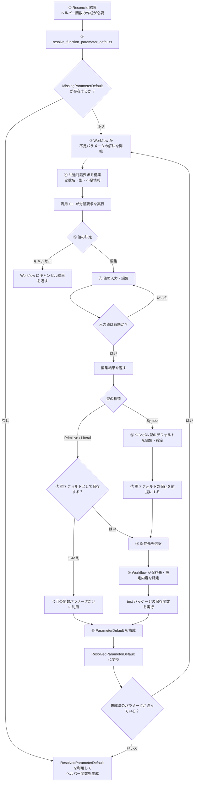

```mermaid
flowchart TD
    A["① Reconcile 結果<br/>ヘルパー関数の作成が必要"] --> B["② resolve_function_parameter_defaults"]
    B --> C{"MissingParameterDefault<br/>が存在するか？"}

    C -- なし --> Z["ResolvedParameterDefault を利用して<br/>ヘルパー関数を生成"]
    C -- あり --> D["③ Workflow が<br/>不足パラメータの解決を開始"]

    D --> E["④ 共通対話要求を構築<br/>変数名・型・不足情報"]
    E --> F["汎用 CLI が対話要求を実行"]
    F --> G{"⑤ 値の決定"}

    G -- 編集 --> H["⑥ 値の入力・編集"]
    H --> I{"入力値は有効か？"}
    I -- いいえ --> H
    I -- はい --> J["編集結果を返す"]
    G -- キャンセル --> X["Workflow にキャンセル結果を返す"]

    J --> K{"型の種類"}
    K -- Primitive / Literal --> L{"⑦ 型デフォルトとして保存する？"}
    K -- Symbol --> M["⑥ シンボル型のデフォルトを編集・確定"]

    M --> N["⑦ 型デフォルトの保存を前提にする"]
    L -- いいえ --> R["今回の関数パラメータだけに利用"]
    L -- はい --> O["⑧ 保存先を選択"]
    N --> O

    O --> P["⑨ Workflow が保存先・設定内容を確定"]
    P --> Q["test パッケージの保存関数を実行"]
    R --> S["⑩ ParameterDefault を構成"]
    Q --> S
    S --> T["ResolvedParameterDefault に変換"]
    T --> U{"未解決のパラメータが残っている？"}
    U -- はい --> D
    U -- いいえ --> Z
```
